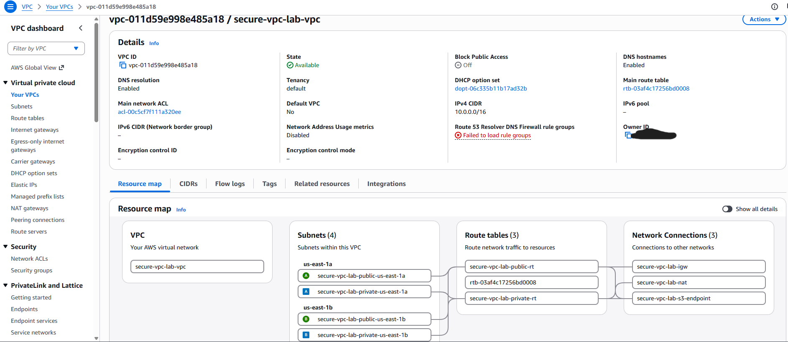
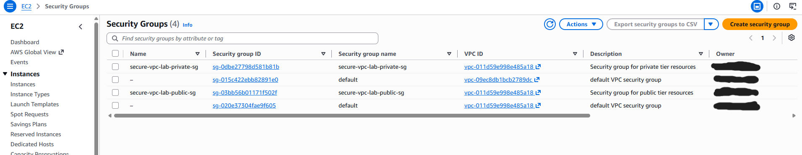
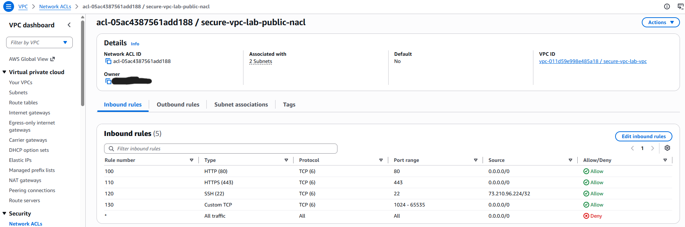
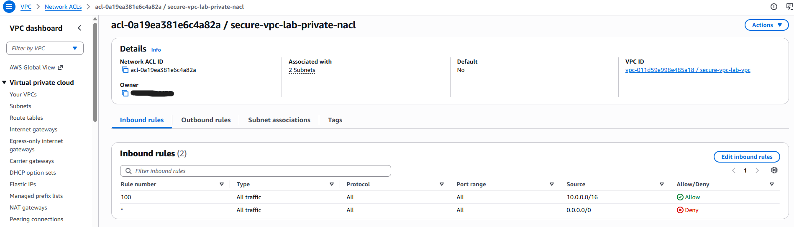
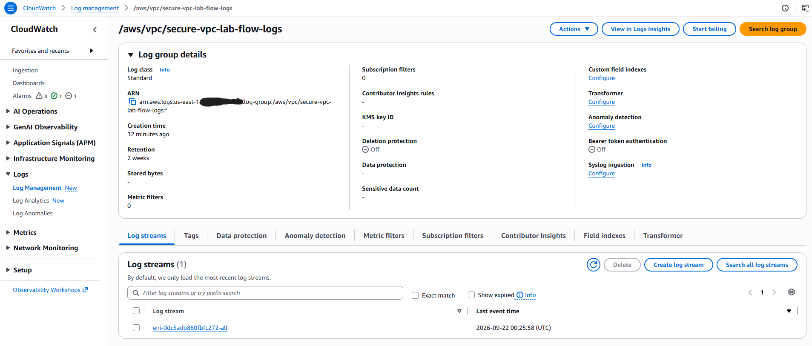
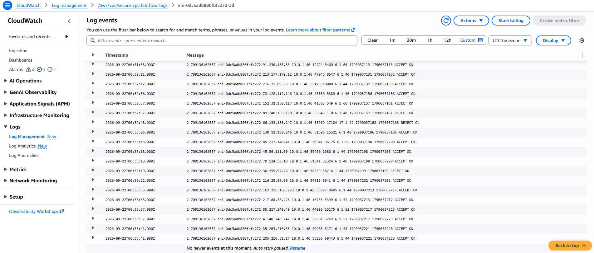
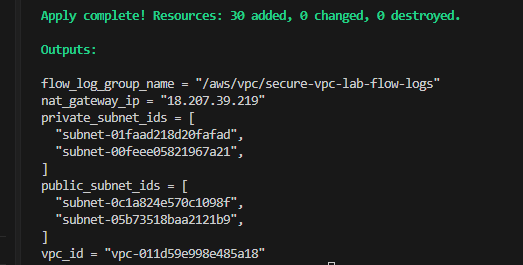
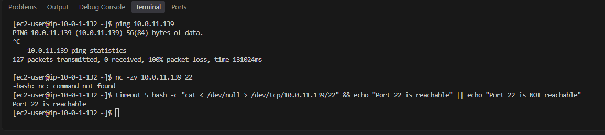
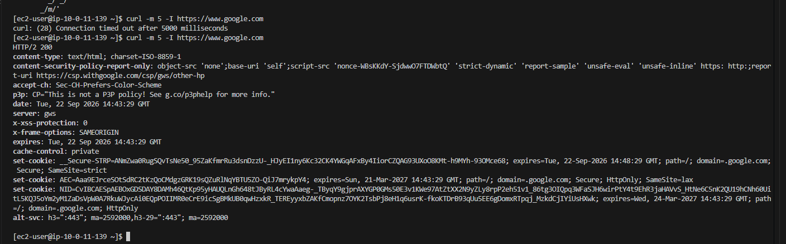

# Secure Multi-Tier AWS VPC — Provisioned with Terraform

## Objective

Designed and provisioned a secure, multi-tier AWS network architecture entirely as code using Terraform — a public/private subnet structure across two Availability Zones, layered network security (Security Groups and NACLs), VPC Flow Logs for network-level visibility, and a free VPC Gateway Endpoint for private S3 access. Unlike Labs 1–3 (built through the AWS Console), this lab's deliverable is the infrastructure-as-code itself, reviewable and re-deployable by anyone with the repo.

## Architecture

```
VPC (10.0.0.0/16)
│
├── Availability Zone A                    ├── Availability Zone B
│   ├── Public Subnet (10.0.1.0/24)        │   ├── Public Subnet (10.0.2.0/24)
│   └── Private Subnet (10.0.11.0/24)      │   └── Private Subnet (10.0.12.0/24)
│
├── Internet Gateway  ── attached to public route table
├── NAT Gateway (in AZ-A public subnet) ── attached to private route table
├── S3 Gateway Endpoint ── attached to both route tables (free, no NAT/internet needed for S3)
│
├── Security Groups
│   ├── public-sg   — HTTP/HTTPS from anywhere, SSH from my IP only
│   └── private-sg  — inbound only from public-sg (no direct internet/SSH access)
│
├── Network ACLs (subnet-level, stateless)
│   ├── public-nacl  — explicit allow rules per port + ephemeral return-traffic range
│   └── private-nacl — allow from VPC CIDR + ephemeral return-traffic range
│
└── VPC Flow Logs → CloudWatch Logs (captures ALL traffic: accepted + rejected)
```

## Why Terraform, and Why This Structure

Building this as code (rather than through the console, as in Labs 1–3) demonstrates a different and complementary skill: reviewable, version-controlled, repeatable infrastructure. The `.tf` files in this repo are the actual deliverable — anyone can read them to understand exactly what gets built, or run `terraform apply` to reproduce the same environment.

Files are split by concern (`vpc.tf`, `subnets.tf`, `routing.tf`, `security_groups.tf`, `nacls.tf`, `flow_logs.tf`, `endpoints.tf`) rather than one large file, matching how real Terraform projects are typically organized for readability and maintainability.

## Design Decisions

### NAT Gateway: A Deliberate, Documented Cost Trade-off

A NAT Gateway (~$0.045/hour plus data processing) was included to give private-subnet resources genuine outbound internet access — the most realistic and complete version of this architecture. This is the only component across all four labs with a non-trivial ongoing cost if left running, so the infrastructure was built, tested, and **deliberately torn down (`terraform destroy`)** after verification rather than left running indefinitely — a normal and expected practice for infrastructure-as-code work, not a limitation of the design.

A single shared NAT Gateway (rather than one per AZ) was used to control cost for a lab environment; a production deployment would typically use one per AZ for redundancy, which is called out below as a natural next step.

### Security Groups vs. NACLs: Two Deliberately Different Layers

Security Groups (stateful, attached to resources) and NACLs (stateless, attached to subnets) were both implemented as a defense-in-depth pair, not redundant duplicates:

- **`private-sg`** references **`public-sg`'s security group ID** as its only allowed source — not a CIDR block — meaning only traffic actually originating from resources in the public tier can reach the private tier, a real identity-based boundary rather than an IP-based one.
- **NACLs** enforce port-level rules at the subnet boundary independently of what's running inside it, including an explicit **deny-by-default** for anything not explicitly allowed (visible in both NACLs' final rule).

### Continuing the Least-Privilege Practice from Lab 3

The `admin-user` IAM account (scoped down in Lab 3 to only the services used in Labs 1–2) required extending with `ec2:*` permissions before Terraform could provision this networking infrastructure. Rather than reverting to a broad policy, the existing `ScopedAdminPolicy` was edited to add exactly the one additional service needed — keeping the same least-privilege discipline as the account's permissions genuinely evolved with real, legitimate new work.

The VPC Flow Logs IAM role follows the same pattern established in Lab 2's Lambda role: a dedicated role scoped to only `logs:CreateLogStream`, `logs:PutLogEvents`, `logs:DescribeLogGroups`, and `logs:DescribeLogStreams` — nothing broader.

## What I Built



- **VPC** (`10.0.0.0/16`) spanning two Availability Zones
- **4 subnets** — one public and one private per AZ
- **Internet Gateway** for public subnet internet access
- **NAT Gateway** (single, shared) for private subnet outbound-only internet access
- **S3 Gateway Endpoint** — free, keeps S3 traffic off the public internet entirely, attached to both route tables



- **Two Security Groups** (`public-sg`, `private-sg`) enforcing tier-based access as described above




- **Two Network ACLs**, one per tier, with explicit numbered allow rules and default-deny



- **VPC Flow Logs** streaming to a dedicated CloudWatch Log Group, capturing all traffic (`ALL` — both accepted and rejected connections)



## Testing & Verification

Rather than relying on `terraform apply` succeeding as the only signal of correctness, two temporary EC2 test instances (one per tier) were launched to prove the architecture actually behaves as designed — then destroyed along with everything else once verified.



1. **SSH into the public instance directly** from a local machine — succeeded, confirming the public tier is reachable as intended.
2. **From the public instance, tested the private instance**:
   - `ping` (ICMP) — **failed, 100% packet loss** — correctly confirming ICMP was never permitted by either security group, only TCP.
   - A raw TCP check against port 22 — **succeeded** — confirming the `private-sg` rule correctly allows traffic originating from `public-sg`.



3. **SSH agent forwarding** was used to hop from the public instance into the private instance without ever placing the private key on a remote host — itself a small security best practice.
4. **Outbound internet access from the private instance** was tested via `curl` to an external site. This initially **failed with a connection timeout**.

### A Real Debugging Story: The Missing Ephemeral Port Rule

The first `curl` attempt from the private instance timed out. Investigating why, rather than assuming a broken NAT Gateway, led to the actual cause: NACLs are stateless, so while the outbound request was allowed to leave, AWS's **response packets** returning from the external server were addressed from outside the VPC's CIDR block — and the private NACL only permitted inbound traffic from the VPC CIDR range itself, correctly blocking what looked like unsolicited external inbound traffic. This is the same "ephemeral port" consideration already built into the public NACL, which had been missed on the private NACL.

The fix was a single, targeted rule — allowing inbound TCP on ports 1024–65535 from anywhere, matching standard ephemeral port practice for any NAT-routed private subnet — rather than a broad "allow everything" change. After applying it, the same test succeeded:



This sequence — a real failure, a correct diagnosis grounded in how NACLs actually behave, and a minimal targeted fix — is included here deliberately as more meaningful evidence of understanding than a first-try success would have been.

## Teardown

All infrastructure, including the two test EC2 instances, was destroyed via `terraform destroy` (33 resources removed) immediately after verification and screenshot collection was complete, to stop the NAT Gateway's ongoing cost. The repository's Terraform files remain fully capable of re-provisioning the identical environment on demand.

## Key Findings

- **NACLs and Security Groups solve different problems and must both be reasoned about independently** — a security group rule being correct does not guarantee a NACL won't still block the same traffic, particularly for stateless return-traffic scenarios like NAT Gateway responses.
- **A "successful" `terraform apply` only proves the AWS API accepted the configuration — it does not prove the network actually behaves as intended.** Functional testing with real instances and real traffic (SSH, ping, curl) surfaced a genuine misconfiguration that `terraform plan`/`apply` had no way to catch.
- **Infrastructure-as-code makes iterating on a live mistake fast and low-risk**: the NACL fix was a four-line resource block, applied in under a minute, without needing to click through console menus mid-debugging session.
- **Least-privilege IAM policies need to evolve alongside real infrastructure needs** — extending Lab 3's scoped policy for EC2/VPC access, rather than reverting to broad access, keeps the account's permissions honest as the account's actual responsibilities grow.

## What I'd Add Next

- **One NAT Gateway per Availability Zone** instead of a single shared one, for real redundancy — deliberately deferred here to control lab cost, but a genuine gap versus a production-grade design.
- **VPC Flow Logs analysis**: extend Lab 1's CloudTrail-based alerting pattern to this network-layer data — for example, a CloudWatch metric filter or EventBridge rule alerting on a spike in `REJECT` entries, which could indicate scanning or misconfigured security rules.
- **Terraform remote state** (e.g., an S3 backend with state locking via DynamoDB) rather than local state, which is the standard practice for any Terraform project used by more than one person or run from more than one machine.
- **Terraform modules**: refactor the public/private subnet and NACL logic into a reusable module, since the current structure duplicates similar patterns across the two tiers.
